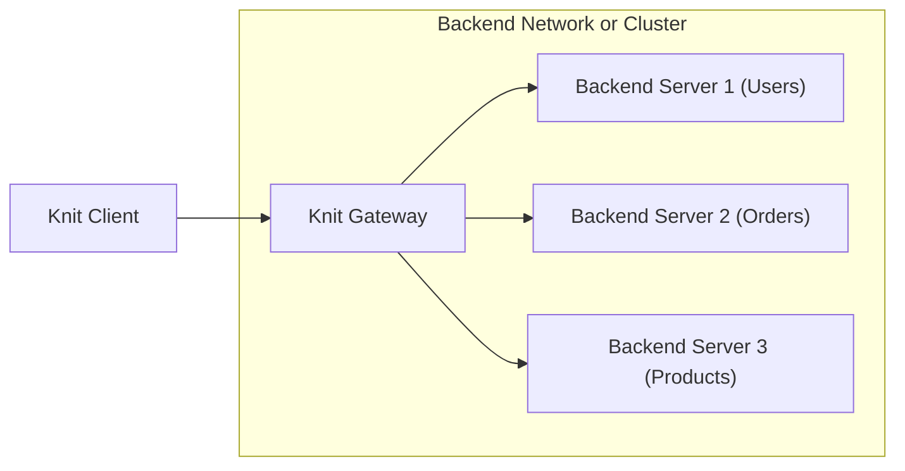

# 🧶 Knit API

[][badges_license]
[][badges_slack]

**Knit brings GraphQL-like capabilities to RPCs. Knit has type-safe and
declarative queries that shape the response, batching support to eliminate
the N+1 problem, and first-class support for error handling with partial
responses. It is built on top of Protobuf and Connect.**

**[Knit] is currently in alpha (α), and looking for feedback. Learn more
about it at the [Knit] repo, and learn how to use it with the [Tutorial].**

---
This repo defines the RPC service that is implemented by a Knit gateway. It is a
protocol that allows batching of RPCs, masking results to shrink on-the-wire
responses, and even joining the results of multiple RPCs.

Knit client libraries provide a type-safe API for translating a Knit query into
an RPC request for this service. The server invokes all indicated RPCs and also
invokes configured resolvers if needed. The resolver can join in extra data
fields, called relations, into a message. (The values for these relations
usually come from additional RPC calls.) Finally, the result is masked to only
return the relevant fields requested.

_This Protobuf module is available on the Buf Schema Registry at
[buf.build/bufbuild/knit](https://buf.build/bufbuild/knit)._

## Knit vs. Connect

Knit is built _on top of_ [Connect](https://connect.build) and _complements_ it.
It provides a way for external clients to interact with a service-oriented
architecture efficiently, without requiring the client to send a large number of
requests over a potentially low-quality network (and to possibly disparate backend
systems) and without needing to implement a
[bespoke frontend API](https://blog.bitsrc.io/bff-pattern-backend-for-frontend-an-introduction-e4fa965128bf).

The caller declares a query that describes the data in which they are interested,
and the Knit gateway translates that into one or more RPC calls to backend servers,
abstracting away the complexity of batching/aggregating, parallelism, and joining
from the caller. Having the batching and result masking happen in a gateway also
means less data needs to be transmitted over unreliable connections, such as to
mobile devices.

Knit also provides a smaller client surface area compared to generating Connect
client code for all the possible RPC endpoints of interest, but without
sacrificing type-safety.

## Architecture

Knit is a three-layer architecture. The key components are
1. The Knit client, which will usually be a web browser or mobile device.
   (See [github.com/bufbuild/knit-ts](https://github.com/bufbuild/knit-ts) for more.)
2. The Knit gateway, which interprets the Knit query protocol, dispatching RPCs to
   relevant backends and aggregating/joining their results.
   (See [github.com/bufbuild/knit-go](https://github.com/bufbuild/knit-go) for more.)
4. Backend services, which are regular Connect and gRPC servers.



## Concepts

A Knit query is how the client declares what RPCs will be invoked
and what data will be returned to the client.

There are several key concepts involved in a Knit query:
* **Entry Point Methods**: A Knit query can indicate one _or more_ RPC
  methods to invoke. Multiple methods in one query effectively batch
  the calls into a single request from the client. The methods named
  in a Knit query are called entry point methods. They are RPC methods
  defined in Protobuf sources. They correspond to endpoints exposed by
  backend services (i.e. Connect or gRPC servers).
* **Masks**: A knit query must define which fields the caller will use.
  The RPC responses will be "masked" to only contain the indicated
  fields. This can reduce the amount of data sent back to the client.
* **Relations**: Relations are a special type of field that can appear in
  a mask. They represent extra attributes that are not part of an RPC
  response, but can be merged into the RPC response. These parts of the
  mask can indicate additional parameters, which are used to resolve the
  values of these attributes (e.g. via another RPC call).

These concepts are described in more detail in the sections below.

### Entry Point Methods

There are three kinds of entry points in Knit, each corresponding to
one of the three methods of the [Knit protocol](https://buf.build/bufbuild/knit/docs/main:buf.knit.gateway.v1alpha1#buf.knit.gateway.v1alpha1.KnitService).
1. _Fetch_: A "fetch" operation executes a query and returns the results.
   Methods that can be invoked via "fetch" must be defined in Protobuf
   source as having no side effects and must be _unary_ (no streaming).
   This is for data that might otherwise be requested via HTTP "GET"
   verb in other frameworks.
2. _Do_: A "do" operation performs an action and returns the results.
   This is just like "fetch", except the methods that are invoked have
   side effects, often mutating state or initiating other processes.
   Like "fetch" methods, they must be defined as unary (no streaming).
3. _Listen_: A "listen" operation sends a request and then receives a
   stream of results. This allows for execution of server-streaming
   methods, often useful for receiving asynchronous notifications from
   the server or for subscribing to an event stream.

Other kinds of methods -- client-streaming or bidirectional-streaming --
cannot be used with Knit. They can still be invoked from clients using
Connect, but can't be incorporated into a Knit query.

Here's an example Protobuf source, demonstrating all the Knit
entry points:
```protobuf
syntax = "proto3";

package pets.v1;

service PetService {
  // These can be used in "fetch" operations because they
  // are unary and have no side effects:
  rpc GetPetTypes(GetPetTypesRequest) returns (GetPetTypesResponse) {
    option idempotency_level = NO_SIDE_EFFECTS;
  }
  rpc GetPet(GetPetRequest) returns (GetPetResponse) {
    option idempotency_level = NO_SIDE_EFFECTS;
  }
  rpc GetPetVetHistory(GetPetVetHistoryRequest) returns (GetPetVetHistoryResponse) {
    option idempotency_level = NO_SIDE_EFFECTS;
  }

  // These can be used in "do" operations because they are
  // unary but may have side effects:
  rpc CreatePet(CreatePetRequest) returns (CreatePetResponse);
  rpc UpdatePet(UpdatePetRequest) returns (UpdatePetResponse);
  rpc CreatePetVetAppointment(CreatePetVetAppointmentRequest)
      returns (CreatePetVetAppointmentResponse);

  // This can be used in "listen" operations:
  rpc SubscribeToPetEvents(SubscribeToPetEventsRequest)
      returns (stream SubscribeToPetEventsResponse);

  // These cannot be incorporated into a Knit query because
  // they use unsupported stream types:
  rpc TransferPetVetHistory(stream TransferPetVetHistoryRequest)
      returns (TransferPetVetHistoryResponse);
  rpc ChatWithCustomerSupport(stream ChatWithCustomerSupportRequest)
      returns (stream ChatWithCustomerSupportResponse);
}
```

The first step in the Knit gateway when executing a query is to issue
RPCs to configured backend services for each method indicated in the
query.

### Masks

The Knit query contains a "mask" for each method. This mask indicates
the fields of the RPC response that should be returned. When a mask
includes a field of the response that is a nested message structure,
a "sub-mask" must be included for that field. Masks are recursive,
allowing fields from arbitrarily deep structures to be named.

Let's look at an example:
```protobuf
message GetUserResponse {
  uint64 id = 1;
  string name = 2;
  string email = 3;
  Address address = 4;
  UserSettings settings = 3;
}

message UserSettings {
  google.protobuf.Timestamp created = 1;
  google.protobuf.Timestamp last_updated = 2;
  AuthnSettings authn = 3;
  EmailSettings email_settings = 4;
  SecurityPreferences security_preferences = 5;
  message TagValue {
    oneof val {
      string string = 1;
      int64 int64 = 2;
      bool bool = 3;
    }
  }
  map<string, TagValue> tags = 6;
}

message SecurityPreferences {
  bool allow_password_login = 1;
  bool is_2fa_enabled = 2;
  bool notify_via_email = 3;
  bool notify_via_sms = 4;
}

// Other message types elided for brevity
```

With the above message definitions, we might define a mask for `GetUserResponse` that looks like so:
```json
{
  "id": {},
  "name": {},
  "settings": {
    "lastUpdated": {},
    "securityPreferences": {
      "notifyViaEmail": {},
      "notifyViaSms": {},
      "is2faEnabled": {}
    },
    "tags": {
      "string": {},
      "int64": {},
      "bool": {},
    }
  }
}
```
The structure/hierarchy of the mask matches the structure of the message
it is masking. The value is empty (`{}`) for scalar fields. It can also
be empty for message fields if the client is interested in the _presence_
of a message field but not its contents (in which case the Knit response
will include an empty message).

With the above example, the response will **not** contain the `email` or
`address` fields of the `GetUserResponse`; the `created`, `authn`, or
`email_settings` fields of `UserSettings`; or the `allow_password_login`
field of `SecurityPreferences`.

Note that repeated fields should provide a sub-mask if the element type is
a nested message. Similarly, map fields must provide a sub-mask if the
_value_ type is a nested message (all keys are always returned; only
values are masked).

Note that sub-masks are _not_ used for fields whose message type is one
of the following [well-known types](https://protobuf.dev/reference/protobuf/google.protobuf/):
* `google.protobuf.Any`
* `google.protobuf.BoolValue`
* `google.protobuf.BytesValue`
* `google.protobuf.DoubleValue`
* `google.protobuf.Duration`
* `google.protobuf.Empty`
* `google.protobuf.FieldMask`
* `google.protobuf.FloatValue`
* `google.protobuf.Int32Value`
* `google.protobuf.Int64Value`
* `google.protobuf.ListValue`
* `google.protobuf.StringValue`
* `google.protobuf.Struct`
* `google.protobuf.Timestamp`
* `google.protobuf.UInt32Value`
* `google.protobuf.UInt64Value`
* `google.protobuf.Value`

Most importantly, this means that masks are not applied to `Any` messages.

### Relations

A mask can indicate a special kind of field -- a field name that is
not actually defined on the message in question. In such cases, the
mask must also include parameters that are used to _resolve_ the value
of that field. If the field doesn't require any parameters then they 
can be omitted.

This special kind of field is called a "relation". It often comes up in
SOA/micro-services architectures, where an attribute of an entity is
actually retrieved via a separate RPC call.

Let's consider an example:
* We have a `UsersService` that knows about the identities and settings
  for all end-users in our application.
* We have a separate `ProductsService` that describes our inventory and
  describes all products available in our application.
* We have an `OrdersService` that contains all orders created and their
  status.

When loading an order details page in our app's UI, we need to retrieve
user settings data from the `UsersService`, the order details from the
`OrdersService`, and product information about the items ordered from
the `ProductsService`. We can fetch the user settings and order details
with a Knit query that _batches_ those two RPCs. But the RPCs for
product details can't be included in the batch because the client doesn't
yet know what product IDs to query. Instead of the client having to do
multiple requests (one for user and order details, and then another query
for product details, built from the items in the order details response),
we can do this all in one request using a relation.

A relation is defined in Protobuf source using a special RPC method.
This method will be implemented by a server in order to actual provide
the resolve values for the relation. We know a method resolves a relation
because it has a custom option `buf.knit.v1alpha1.relation`:
```protobuf
service OrderRelations {
  rpc GetOrderProductDetails(GetOrderProductDetailsRequest)
      returns (GetOrderProductDetailsResponse) {
    // The presence of the (buf.knit.v1alpha1.relation) option tells us
    // this method is used to resolve a relation. The relation is named
    // "product_details" (or "productDetails" when converted to camel-case
    // for TypeScript clients).
    option (buf.knit.v1alpha1.relation).name = "product_details";
    option idempotency_level = NO_SIDE_EFFECTS;
  }
  message GetOrderProductDetailsRequest {
    // All resolvers are "batch" resolver: they accept a batch of
    // entities to resolve all in one RPC call. Thus this field
    // is repeated. This first field indicates the type of entity
    // into which the relation is injected. In this case, this
    // product_details relation will be injected into an Order.
    repeated Order bases = 1;
    // Any other fields in the request are additional parameters
    // that can be included in a Knit query that uses this relation.
    int32 limit_num_products = 1;
  }
  message GetOrderProductDetailsResponse {
    // We must use a repeated field here. Each entry in this field
    // corresponds (in order) to an Order in the request.
    repeated OrderResult values = 1;
    message OrderResult {
      // This is the field that gets injected into an Order entity.
      repeated ProductDetails product_details = 1;  
    }
  }
}
```
If we include a field named `productDetails` in the mask of our Knit
query, the Knit gateway will invoke the above RPC to _resolve_ the details
and include them in the response data for the `Order`. _How_ the value is
resolved is up to the method implementation.

This example shows a relation that has an additional _parameter field_. This
allows the Knit query to supply additional information that can be used by
the resolution logic. For example, here's a possible mask for the `Order`
message:
```json
{
  "id": {},
  "orderCreateDate": {},
  "shippedDate": {},
  "deliveredDate": {},
  "orderState": {},
  "productIds": {},
  "productDetails": {
    "$": {
      "limitNumProducts": 10
    }
  }
}
```

In this case, the `limitNumProducts` attribute in the query is used to
return only a subset of product details instead of all of them (which
may be valuable for orders with a very large number of products).

## Caveats

The Knit protocol relies heavily on the [JSON mapping](https://protobuf.dev/programming-guides/proto3/#json)
for Protobuf messages, even if the client is sending Knit queries in the
Protobuf binary format. Masks are defined using names, not tag numbers,
and relations are also indicated by name. This is done largely to simplify
the web client and make JS bundle sizes vanishingly small.

But this does mean that fields in Protobuf sources cannot be renamed without
breaking backwards-compatibility. And since the JSON format is used in some
places, custom JSON names cannot be changed either.

Note that the default rules for [breaking change detection](https://docs.buf.build/breaking/overview)
in the Buf CLI (i.e. `buf breaking`) will suffice to prevent breakages as they
are more strict than simply verifying wire-format compatibility.

## Status: Alpha

Knit is undergoing initial development and is not yet stable.

## Legal

Offered under the [Apache 2 license][badges_license].

[badges_license]: https://github.com/bufbuild/knit-api/blob/main/LICENSE
[badges_slack]: https://buf.build/links/slack
[knit]: https://github.com/bufbuild/knit
[tutorial]: https://github.com/bufbuild/knit/tree/main/tutorial

